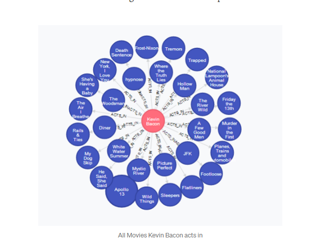

Non-relationalDB(NOSQL)
=====
## The rise of NOSQL
SQL was actually fine until another engineer showed up and invented the World Wide Web, in 1989.

## NOSQL 
- Non-relational databases existed in the late 1960’s, but the term was not used until 1998 by Carlo Strozzi who led the development of NoSQL.
- “A NoSQL (originally referring to "non SQL" or "non relational")[1] database provides a mechanism for storage and retrieval of data that is modeled in means other than the tabular relations used in relational databases.”

There are four popular non-relational types: document data store, column-oriented database, key-value store and graph database.  Often combinations of these types are used for a single application.

## Columnar (or column oriented) data stores
A columnar data store organizes data into columns, which is conceptually similar to the relational database. The true advantage of a column-family database is in its denormalized approach to structuring sparse data, which comes from its column-oriented approach to storing data.

Apache HBase, Cassandra

## Key-value stores
This is the least complicated of the NoSQL databases and, as the name would indicate, the key-value store is simply a collection of key-value pairs contained within an object. You can store a value, such as an integer, string, a JSON structure, or an array, along with a key used to reference that value

Redis, Amazon DynamoDB

## Document-Oriented Database
Document stores are a bit more complex than key-value stores.  They don’t assume a particular document structure specified with a schema. The document store is designed to store everyday documents as is, and they allow for complicated querying.

MongoDB, Couchbase

## Graph databases

It’s designed to efficiently store relations between entities. When data is greatly interconnected, such as purchasing and manufacturing systems or referencing catalogs, graph databases are a good solution.

The possibilities for graph NoSQL databases are infinite, and with the data we collect becoming increasingly interconnected, graph databases are going to continue to gain in popularity, including the still-dominant relational database.

Instead of the Structure Query Language (SQL) used by relational databases, the NoSQL database uses Object-relational-mapping (ORM).  The concept of ORM is the ability to write queries using your preferred programming language.  Some of the more popular ORMs are Java, Javascript, .NET and PHP.

