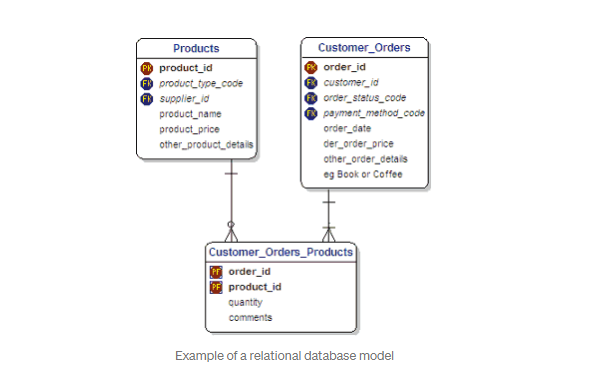

RelationalDB(SQL)
======

## The creation of SQL

Our story starts at IBM Research in the early 1970s, where the relational database was born. At that time, query languages relied on complex mathematical logic and notation. Two newly minted PhDs, Donald Chamberlin and Raymond Boyce, were impressed by the relational data model but saw that the query language would be a major bottleneck to adoption. They set out to design a new query language that would be (in their own words): “more accessible to users without formal training in mathematics or computer programming.”

## RelationalDB

Defined by E.F Codd in 1970, a relational database is a digital database based on the relational model of data. The data is stored in tables containing rows (which represents an entry) and columns(which stores and sorts a specific type of information). Relationships are established through Primary and Foreign keys.

Relational databases work best when the data they contain doesn’t change very often, and when accuracy is crucial. Relational databases are, for instance, often found in financial applications.

## Advantages
- Can handle lots of complex queries, database transactions, and routine analysis of data.
- ACID(Atomity, Consistency, Isolation, Durability): Set of properties that ensure reliable database transactions.

## Disadvantages
- What if our datasets are too large or unstructured?

## What is a relation?
- unique tuples
- the tuples of a body do not appear in any particular order 
- the attributes of an element do not appear in any particular order either, nor, therefore do the elements of a tuple

