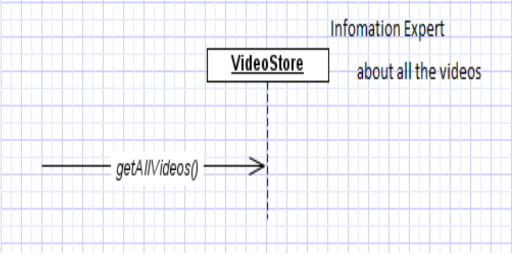

Expert
====

### Problem
- What is a basic principle by which to assign responsibilities to objects?

Solution:
- Expert principle says – assign those responsibilities to o for which o has the information to fulfill that responsibility.
- They have all the information needed to perform operations, or in some cases they collaborate with others to fulfill their responsibilities.
- an object's own state, the
world around an object, information the object can derive, and so forth

## Example
- Assume we need to get all the videos of a VideoStore.
- Since VideoStore knows about all the videos, we can assign this responsibility of giving all the videos can be assigned to VideoStore class.
- VideoStore is the information expert.

