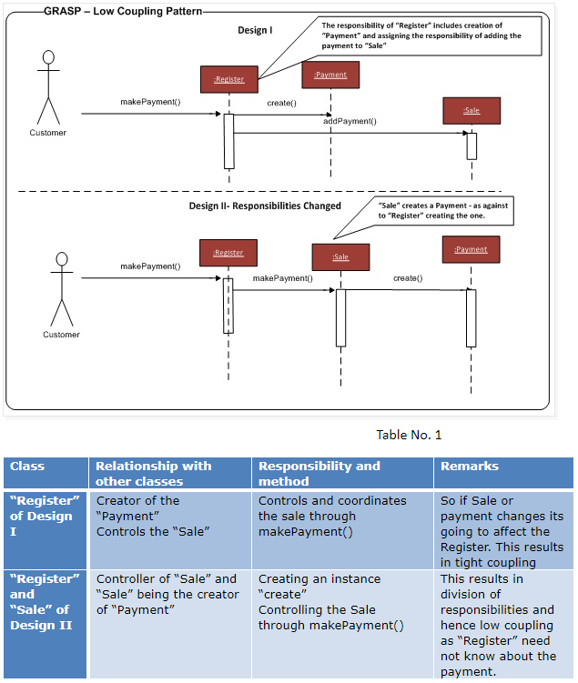

Low Coupling(D)
=====
**Coupling** is a measure of how strongly one element is connected to, has knowledge of, or depends on other elements.  If there is coupling or dependency, then when the depended-upon element changes, the dependant may be affected. For example, a subclass is strongly coupled to a superclass. An object A that calls on the operations of object B has coupling to B's services.

Problem:
- How to reduce the impact of change?

Solution:
- Assign responsibilities so that (unnecessary) coupling remains low. Use this principle to evaluate alternatives.

 Low Coupling tends to reduce the time, effort, and defects in modifying software

- How strongly the objects are connected to each other?  
- Coupling – object depending on other object.
- When depended upon element changes, it affects the dependant also.
- Low Coupling – How can we reduce the impact of change in depended upon elements on dependant elements.
- Prefer low coupling – assign responsibilities so that coupling remain low.
- Minimizes the dependency hence making system maintainable, efficient and code reusable 

