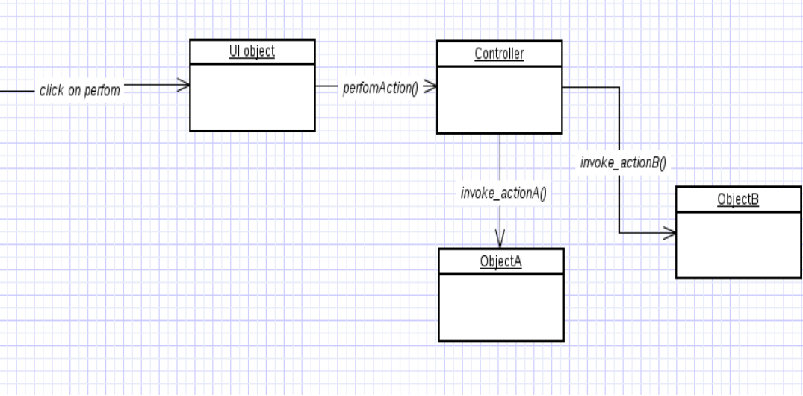

Controller
=====

### Problem:
- Who should be responsible for handling a system event?
- What first object beyond the UI layer receives and coordinates ("controls") a system operation?

### Solution:

Assign the responsibility to an object representing one of these choices:
- Represents the overall "system," a "root object," a device that the software is
running within, or a major subsystem (these are all variations of a facade
controller).
- Represents a use case scenario within which the system operation occurs (a use
case or session controller)
- Represents the overall business (facade controller)
- Represents something in real world that is active (role controller)

These classes often don’t do the work themselves, but delegate it to others and in other terms it coordinates or controls the activity.

-----

- Deals with how to delegate the request from the UI layer objects to domain layer objects.
- when a request comes from UI layer object, Controller pattern helps us in determining what is that first object that receive the message from the UI layer objects.
- This object is called controller object which receives request from UI layer object and then controls/coordinates with other object of the domain layer to fulfill the request.
- It delegates the work to other class and coordinates the overall activity.

