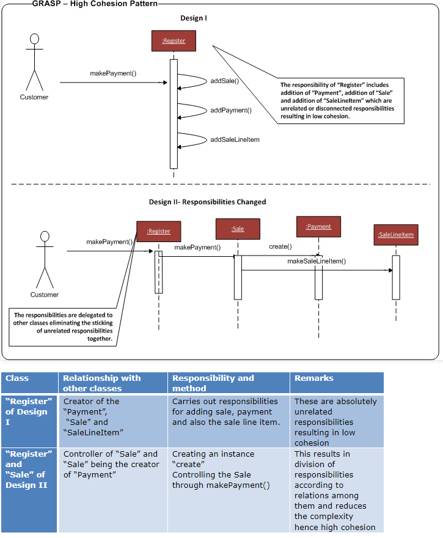

High Cohesion
====
**Cohesion** informally measures how functionally related the operations of a software element are, and also measures how much work a software element is doing.

A class with low cohesion does many unrelated things or does too much work. 

As a rule of thumb, a class with high cohesion has a relatively small number of methods, with highly related functionality, and does not do too much work. It collaborates with other objects to share the effort if the task is large.

Problem:
- How to keep objects focused, understandable, and manageable, and as a side effect, support Low Coupling?

Solution: 
- Assign responsibilities so that cohesion remains high. Use this to evaluate alternatives.

-----

- How are the operations of any element are functionally related?
- Related responsibilities in one manageable unit.
- Prefer high cohesion
- Clearly defines the purpose of the element
- Benefits
  - Easily understandable and maintainable.
  - Code reuse
  - Low coupling
  

