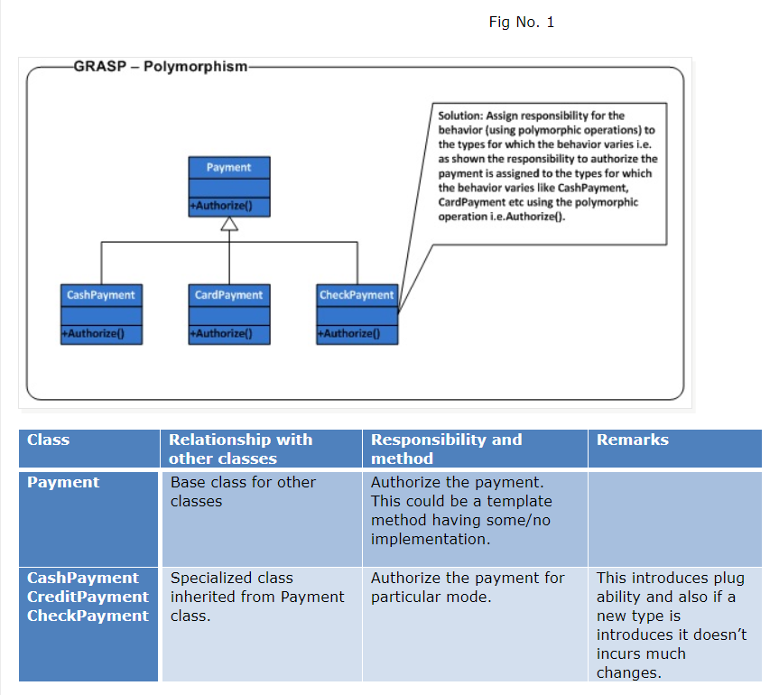

Polymorphism
====

Problem:
- How to handle alternatives based on type? How to create pluggable software components?

Solution:
- Assign responsibility for the behavior (using polymorphic operations) to the types for which the behavior varies

GoF pattern that rely on this:  Adapter, Command, Composite, Proxy, State, and Strategy
