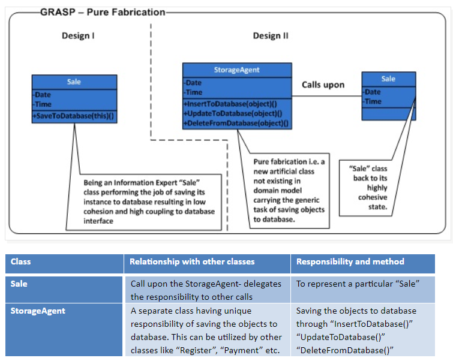

Pure fabrication
========

Imagine scenario where the existing classes have low cohesion and high coupling rather it violates the High cohesion and low coupling. It would be overkill to change the existing classes in entirety or even it could be unviable from the perspective of budget(and time)

Problem:
- What object should have the responsibility, when you do not want to violate High Cohesion and Low Coupling, or other goals, but solutions offered by Expert (for example) are not appropriate?

Solution:
- Assign a highly cohesive set of responsibilities to an artificial or convenience class that does not represent a problem domain conceptsomething made up, to support high cohesion, low coupling, and reuse.
- Such a class is a fabrication of the imagination. Ideally, the responsibilities assigned to this fabrication support high cohesion and low coupling, so that the design of the fabrication is very clean, or pure, hence a pure fabrication.

