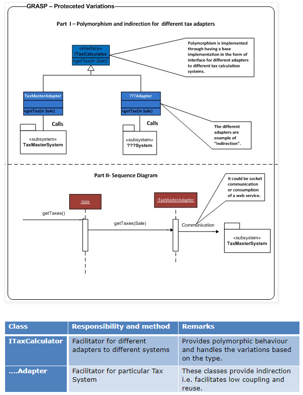

Protected variations
======
The focus is on protecting the existing objects from variations. i.e. creating a stable interface so to protect from variations in coupled objects

So the changes (variations) in the software systems are inevitable. If some part in a system is changed it would have effect on other parts/elements of the system. Many a times such changes are destabilizing ones.

So is there any way to minimize the effects or way to ensure that such changes (variations) don’t have undesirable effects on other elements or system operation? Yes, exactly that’s the principle for pattern “Protected Variation”.

Problem:
- How to design objects, subsystems, and systems so that the variations or instability in these elements does not
have an undesirable impact on other elements?

Solution: 
- Identify points of predicted variation or instability; assign responsibilities to create a stable interface around them. 

Similar to Open-Close principle

