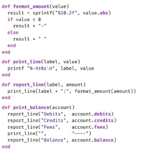

Dry (Don't repeat yourself)
====
It is a software development principle aiming to reduce code duplication which can lead to a poor refactoring and a poor maintenance.

"Every piece of knowledge must have a single, unambiguous, authoritative representation within a system"

Decompose complex algorithms/functions into simple functions

- Loggers
```
def print_balance(account)
  printf "Debits: ${value}\n", account.debits
  if account.fees < 0
    printf "Fees: ${value}\n", -account.fees
  else
    printf "Fees: ${value}\n", account.fees
  if account.balance < 0
    printf "Balance: ${value}\n", -account.balance
  else
    printf "Balance: ${value}\n", account.balance
```



- The name should says what it does